# Padrão Netflix de Login (Refresh Tokens)

Esta skill define a arquitetura padrão para garantir que o usuário não seja desconectado frequentemente, mantendo a segurança (Access Token de curta duração + Refresh Token de longa duração).

## Entendendo a Arquitetura (O Cofre de Passaportes)

Quando o usuário faz login, o sistema gera DOIS tokens:
1. **Access Token (Crachá):** Dura poucos minutos/dias. Vai em todas as requisições normais. Não é salvo no banco, o Spring Boot apenas verifica a assinatura criptográfica.
2. **Refresh Token (Passaporte):** Dura muito tempo (ex: 30 dias). É salvo na tabela `refresh_tokens` vinculado ao ID do usuário.

Se o Crachá vencer, o Frontend intercepta o erro HTTP 401, pega o Passaporte que guardou no celular (SecureStore) e envia para a rota `/refresh` do Backend. O Backend olha na tabela `refresh_tokens`, vê que o passaporte existe, é verdadeiro e não venceu, e devolve um Crachá novinho. O Frontend então refaz a requisição original de forma transparente. O usuário nunca percebe.

### Diagrama de Sequência

```mermaid
sequenceDiagram
    participant U as Usuário (App)
    participant F as Frontend (Interceptor)
    participant B as Backend (Spring Boot)
    participant DB as Banco de Dados

    Note over U, DB: 1. Login Inicial
    U->>B: POST /login (email, senha)
    B->>DB: Salva RefreshToken(30 dias)
    B-->>U: Retorna {Access(15m), Refresh(30d)}
    
    Note over U, DB: 2. Requisição Normal (com Access Token válido)
    U->>F: Ação: "Salvar Cliente"
    F->>B: POST /clientes (Bearer AccessToken)
    B-->>F: 200 OK (Sucesso)
    F-->>U: Interface atualizada!

    Note over U, DB: 3. Requisição (com Access Token expirado)
    U->>F: Ação: "Salvar Cliente"
    F->>B: POST /clientes (Bearer AccessToken Vencido)
    B-->>F: 401 Unauthorized

    Note over F, B: 4. A Mágica (O Padrão Netflix)
    F->>F: Congela requisição original
    F->>B: POST /refresh (RefreshToken)
    B->>DB: Valida se o RefreshToken existe e está na validade
    B-->>F: 200 OK Retorna {Novo AccessToken}
    
    Note over F, B: 5. Retentativa Invisível
    F->>B: POST /clientes (Bearer NOVO AccessToken)
    B-->>F: 200 OK (Sucesso)
    F-->>U: Interface atualizada! (Sem pedir senha)
```

## Backend (Spring Boot + PostgreSQL)
1. **Tabela BD:** Deve existir uma tabela `refresh_tokens` com `token` (String, unique), `data_expiracao` (Timestamp), e FK para o usuário.
2. **Tokens Emitidos:** O `/login` e `/register` devem retornar um Access Token (curto, JWT na memória) e um Refresh Token (longo, persistido no banco).
3. **Endpoint de Refresh:** Deve existir a rota `/api/auth/refresh` que recebe o Refresh Token, valida no banco de dados e emite um novo Access Token.

## Frontend (React Native)
1. **Armazenamento:** Ambos os tokens devem ser armazenados usando `expo-secure-store`.
2. **Interceptor Invisível:** A classe/serviço que cuida do `fetch()` deve capturar erros `401 Unauthorized`.
3. **Fluxo de Retentativa:** 
   - Ao receber 401, pause a requisição original.
   - Dispare uma chamada para `/api/auth/refresh` usando o Refresh Token salvo.
   - Se retornar 200, salve o novo Access Token e re-execute a requisição original.
   - Se retornar erro (Refresh expirou ou foi revogado no banco), deslogue o usuário limpando o SecureStore e redirecione para a tela de Login.
